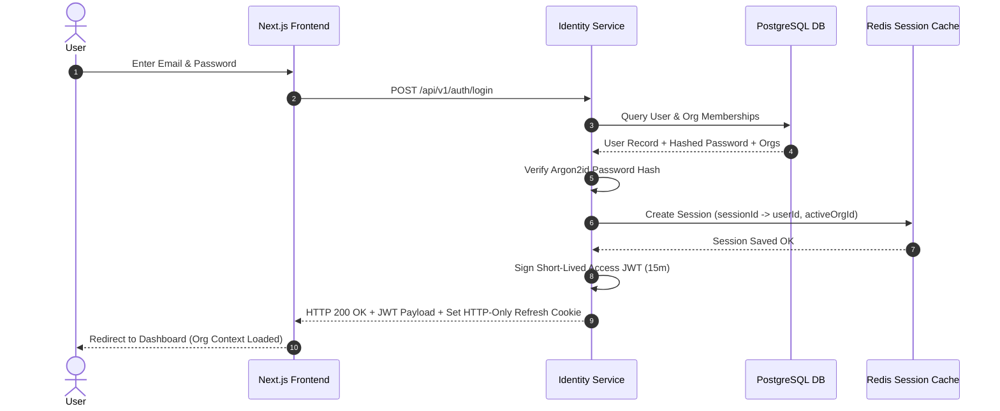
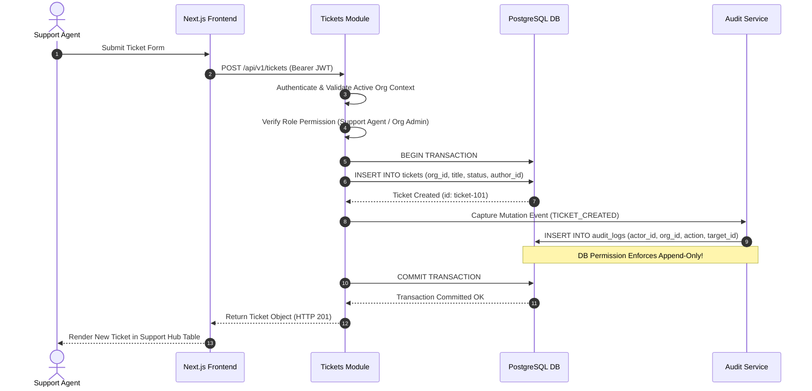
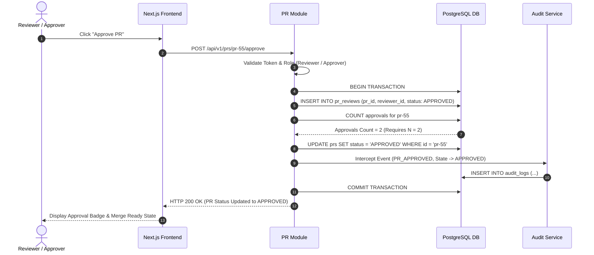
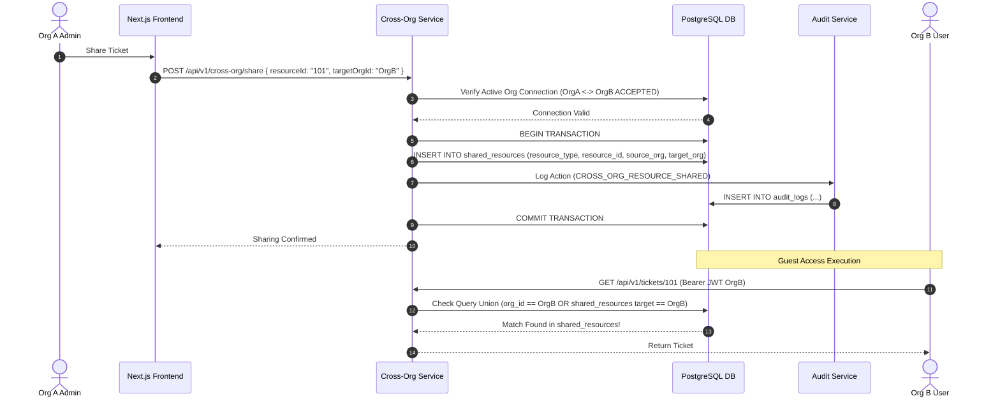
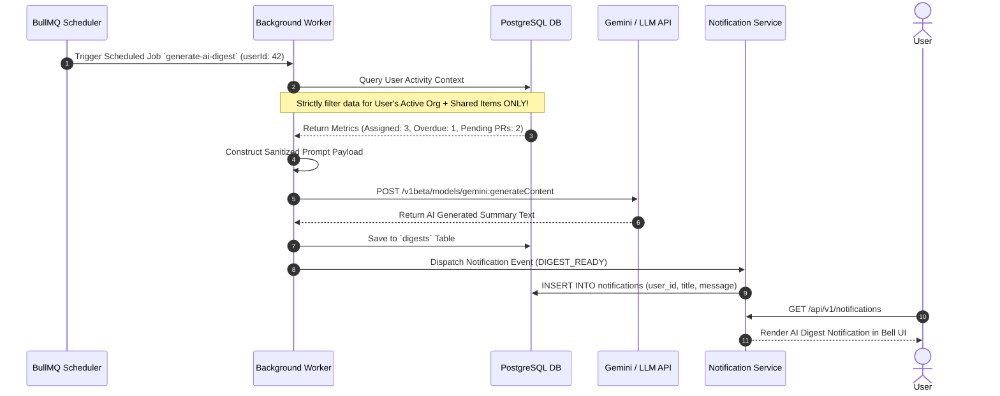

# Production-Ready System Architecture Document
## Unified Organization Workspace (Ticketing + PR/Audit Console)

---

## 1. High-Level System Architecture

The Unified Organization Workspace is designed as a **Modular Monolith Backend** paired with a **Unified Next.js Frontend App** (or twin dashboard sub-apps sharing a common design system under one parent domain). This architecture balances clean modular domain separation with low deployment complexity, zero inter-service network latency, and transactional boundary consistency across multi-tenant operations.

```
                                 +-------------------------------------------------------+
                                 |                  CLIENT BROWSER                       |
                                 |                                                       |
                                 |   +-----------------------+ +---------------------+   |
                                 |   |  Dashboard 1:         | |  Dashboard 2:       |   |
                                 |   |  Support Hub          | |  Review & Audit     |   |
                                 |   +-----------------------+ +---------------------+   |
                                 |               \                 /                     |
                                 |                Shared UI & Auth                       |
                                 +---------------------------+---------------------------+
                                                             |
                                               HTTPS / REST API / WSS
                                                             |
                                                             v
                                 +-------------------------------------------------------+
                                 |                   API GATEWAY / NGINX                 |
                                 |            (TLS Termination, Rate Limiter)            |
                                 +---------------------------+---------------------------+
                                                             |
                                                             v
+-------------------------------------------------------------------------------------------------------------------+
|                                            MODULAR MONOLITH BACKEND SERVICE                                       |
|                                                                                                                   |
|  +-------------------+  +-------------------+  +-------------------+  +-------------------+  +-----------------+  |
|  | Identity & Org    |  | Support Hub       |  | Review & Audit    |  | Cross-Org         |  | AI &           |  |
|  | Module            |  | Module            |  | Console Module    |  | Service           |  | Notifications   |  |
|  +---------+---------+  +---------+---------+  +---------+---------+  +---------+---------+  +--------+--------+  |
|            |                      |                      |                      |                     |           |
|            +----------------------+----------------------+----------------------+---------------------+           |
|                                                          |                                                        |
|                                               +----------v----------+                                             |
|                                               |  Audit Interceptor  |                                             |
|                                               +----------+----------+                                             |
+----------------------------------------------------------|--------------------------------------------------------+
                                                           |
                      +------------------------------------+------------------------------------+
                      |                                    |                                    |
                      v                                    v                                    v
       +------------------------------+     +------------------------------+     +------------------------------+
       |       POSTGRESQL DATABASE    |     |          REDIS CACHE         |     |          LLM API             |
       |  (Application & Immutable    |     |  (Sessions, Blacklist,       |     |   (Gemini / OpenAI API       |
       |     Append-Only Audit)       |     |   BullMQ Queue, Rate Limit)   |     |    for AI Summaries)        |
       +------------------------------+     +------------------------------+     +------------------------------+
                                                           ^
                                                           | (Jobs Queue)
                                                           v
                                            +------------------------------+
                                            |   BACKGROUND WORKER RUNNER   |
                                            |  (AI Digest & Cron Handler)  |
                                            +------------------------------+
```

---

## 2. Module Responsibilities

| Module | Core Responsibility |
| :--- | :--- |
| **Identity Service** | Manages user registration, credential authentication, JWT token issuance, refresh token rotation, active organization switching context, and global logout revocation. |
| **Support Hub (Tickets Module)** | Handles ticket CRUD operations, comments, file attachments metadata, ticket lifecycle statuses, ticket sharing permissions, and per-tenant feature flag checks. |
| **Review & Audit Console (PR Module)** | Manages Pull Request entities, $N$-approval rules, change requests, PR versioning snapshots with side-by-side diff generation, and PR lifecycle states. |
| **Audit Service** | Intercepts all state mutations across both dashboards and cross-org actions. Ensures immutable write-only append operations to PostgreSQL and powers the searchable/filterable CSV audit timeline. |
| **Cross-Org Collaboration Service** | Manages Organization-to-Organization connection requests, acceptance, and revocations. Handles granular item-level sharing policies and guest permission scoping. |
| **AI Digest Service** | Asynchronously gathers scoped user activity metrics (assigned/overdue tickets, idle PRs), formats secure prompt contexts, interacts with the LLM API, and formats digests. |
| **Notification Service** | Dispatches in-app bell notifications and real-time updates for digest arrivals, PR review requests, ticket assignments, and cross-org share invitations. |
| **Background Job Scheduler** | Powered by BullMQ and Redis; runs cron schedules for periodic AI digests, idle PR check alerts, notification cleanups, and token purge tasks. |
| **Redis Layer** | Serves as the central state store for JWT revocation blacklists, active refresh token sessions, active org context cache, rate limit counters, and background queues. |
| **PostgreSQL Database** | Primary relational store housing users, orgs, tickets, PRs, version snapshots, connections, feature flags, and the database-permission-enforced append-only audit log table. |
| **Frontend UI (Next.js)** | Provides a unified, responsive client experience for both dashboards, containing shared component libraries, org switcher dropdowns, global session providers, and diff viewers. |

---

## 3. Inter-Module Communication Architecture

```
[ HTTP Request ] ---> [ Auth Middleware ] ---> [ Domain Controller ] ---> [ Domain Service ]
                                                                             |
                                                                             +---> [ DB Access Layer ]
                                                                             |
                                                                             +---> [ Audit Interceptor (Sync) ]
                                                                             |
                                                                             +---> [ Event Bus / Redis PubSub (Async) ]
                                                                                         |
                                                                                         +--> [ Notification Handler ]
                                                                                         +--> [ BullMQ Queue (Async Jobs) ]
```

1. **Synchronous In-Process Invocations**: Modules interact via strict TypeScript service interfaces within the monolith backend. Direct database table cross-reading across domain boundaries is prohibited; services expose clean domain methods (e.g., `TicketService.getTicketByIdForUser()`).
2. **Asynchronous Event Bus (Redis Pub/Sub & EventEmitter)**: Domain events (e.g., `TICKET_CREATED`, `PR_APPROVED`, `CROSS_ORG_SHARE_GRANTED`) are emitted to an internal event bus. The Audit Interceptor listens synchronously to guarantee audit logging within the database transaction, while the Notification Service consumes events asynchronously to update user notification feeds.
3. **Background Task Queue (BullMQ)**: Delayed and scheduled background operations (such as generating AI digests every morning) are pushed to Redis BullMQ queues. The isolated Background Worker runner picks up jobs without impacting main HTTP request throughput.

---

## 4. Authentication Architecture

```
Client                             API Gateway / Auth Service                      Redis Session Cache
  |                                            |                                           |
  |--- 1. POST /api/auth/login (email/pass) -->|                                           |
  |                                            |--- 2. Verify Credentials & Active Org --->|
  |                                            |--- 3. Create Session (sessionId) -------->|
  |                                            |<-- 4. Store Refresh Token (7 days) -------|
  |<-- 5. Return JWT Access Token (15 min) +---|                                           |
  |       Set HTTP-Only Cookie (Refresh)       |                                           |
  |                                            |                                           |
  |--- 6. GET /api/tickets (Bearer JWT) ------>|                                           |
  |                                            |--- 7. Check JWT Blacklist (jti) --------->|
  |                                            |<-- 8. Valid Token ------------------------|
  |<-- 9. Authorized Response -----------------|                                           |
  |                                            |                                           |
  |--- 10. POST /api/auth/logout-everywhere -->|                                           |
  |                                            |--- 11. Blacklist active JWT (jti) ------->|
  |                                            |--- 12. Delete all sessions for userId ---->|
  |<-- 13. Clear Cookies & Confirm Logout -----|                                           |
```

* **JWT Access Token**: Short-lived (15 minutes). Payload contains `{ userId, activeOrgId, roles: [...], sessionId, jti, exp }`. Signed using `RS256` or `HS256` with strong secret keys.
* **Refresh Token**: Long-lived (7 days), stored in an `HttpOnly`, `Secure`, `SameSite=Strict` cookie. The refresh token contains a unique `sessionId` mapped to a Redis key `ref:session:<sessionId>`.
* **Logout Everywhere**: Invalidates all `sessionId` keys in Redis associated with `user:<userId>:sessions`. Simultaneously adds the active JWT's unique identifier (`jti`) to the Redis revocation blacklist key `jwt:blacklist:<jti>` with an expiration matching the JWT's remaining lifetime.
* **Session Synchronization**: Since both dashboards live under one parent domain (e.g., `app.workspace.com/support` and `app.workspace.com/review` or `support.workspace.com` and `review.workspace.com`), cookies are scoped to `.workspace.com`. Token refresh calls update the session state globally.

---

## 5. Organization Switching Architecture

```
User (Multi-Org)                 Frontend Context                    Identity API                     Redis Cache
   |                                    |                                 |                                |
   |-- 1. Select Org B from Switcher -->|                                 |                                |
   |                                    |-- 2. POST /api/auth/switch-org->|                                |
   |                                    |      { targetOrgId: "OrgB" }    |                                |
   |                                    |                                 |-- 3. Verify Membership in OrgB |
   |                                    |                                 |-- 4. Fetch User Role in OrgB   |
   |                                    |                                 |-- 5. Update Active Org Cache ->|
   |                                    |                                 |-- 6. Issue New JWT (OrgB) ---->|
   |                                    |<-- 7. Return New Access Token --|                                |
   |                                    |-- 8. Invalidate React Queries ->|                                |
   |<-- 9. UI re-renders with OrgB data-|                                 |                                |
```

1. **Verification**: When `POST /api/auth/switch-org` is invoked with `targetOrgId`, the Identity Service checks the `org_memberships` table to verify the user belongs to `targetOrgId`.
2. **Context Update**: If valid, the Identity Service updates `user:<userId>:active_org` in Redis.
3. **Token Re-issuance**: A new Access Token is generated containing `activeOrgId = targetOrgId` and the specific roles held by the user in `targetOrgId`. The old access token `jti` is blacklisted in Redis.
4. **Client Reactivity**: The client auth context updates its in-memory token, invalidates cache queries across both dashboards, and re-fetches tickets, PRs, and feature flags scoped to `OrgB`.

---

## 6. Cross-Organization Collaboration Architecture

```
Org A (Owner Org)              Cross-Org Service              Org B (Partner Org)          Guest User (Org B)
  |                                   |                                |                              |
  |-- 1. Request Org Connection ----->|                                |                              |
  |                                   |--- 2. Create PENDING Link ---->|                              |
  |                                   |<-- 3. APPROVE Connection ------|                              |
  |                                   |    (Status = ACCEPTED)         |                              |
  |                                   |                                |                              |
  |-- 4. Share Ticket #101 ---------->|                                |                              |
  |   with Partner Org B / User B     |--- 5. Insert SharedResource --->|                              |
  |                                   |    (TICKET, 101, Org A, Org B) |                              |
  |                                   |                                |                              |
  |                                   |                                |<-- 6. GET /api/tickets/101 --|
  |                                   |<-- 7. Evaluate Authorization --|                              |
  |                                   |    (Query Union Check)         |                              |
  |                                   |--------------------------------|--- 8. Return Ticket #101 --->|
  |                                   |                                |    (READ / COMMENT ONLY)     |
```

1. **Handshake Protocol**: Org A sends a connection request to Org B. A record in `org_connections` is created (`status: PENDING`). An Org Admin in Org B approves it (`status: ACCEPTED`). Either org can unilaterally call `REVOKE` at any time.
2. **Resource-Level Sharing**: Once connected, an Org Admin or Support Agent in Org A can share a specific ticket or PR with Org B. This writes a record to `shared_resources` (`resourceType`, `resourceId`, `sourceOrgId`, `targetOrgId`, `targetUserId`, `permissions: READ_COMMENT`).
3. **Scoped Guest Authorization**: When a user from Org B attempts to access Ticket #101, the authorization engine evaluates:
   $$\text{Access Granted} \iff (\text{ticket.orgId} == \text{user.activeOrgId}) \lor \text{EXISTS}(\text{shared\_resources WHERE resourceId}=101 \land \text{targetOrgId}=\text{user.activeOrgId})$$
4. **Access Restrictions**: External users are assigned the virtual role `Cross-Org Guest` for that item. Mutation handlers strictly block `UPDATE_TICKET`, `DELETE_TICKET`, `CHANGE_STATUS`, or accessing any non-shared tickets from Org A.

---

## 7. Role-Based Access Control (RBAC) Architecture

The system enforces a 2-tier authorization matrix combining **Organization-Level Roles** and **Resource-Level Permission Scopes**:

```
                               +----------------------------------+
                               |     Authenticated User Context   |
                               | (userId, activeOrgId, role, etc) |
                               +----------------+-----------------+
                                                |
                                                v
                               +----------------------------------+
                               |    Authorization Middleware      |
                               +----------------+-----------------+
                                                |
              +---------------------------------+---------------------------------+
              |                                 |                                 |
              v                                 v                                 v
   [ Org-Level Role Check ]          [ App / Module Permission ]      [ Resource Scoping Filter ]
   (e.g., Org Admin, Agent)          (e.g., PR_APPROVE, TICKET_READ)  (Own Org OR Explicit Share)
```

### Permission Matrix

| Role | Support Hub (Dash 1) | PR Console (Dash 2) | Audit Viewer | Cross-Org Mgmt | Platform Admin |
| :--- | :--- | :--- | :--- | :--- | :--- |
| **Platform Super Admin** | Full Access | Full Access | Full Access | Manage All Orgs/Connections | Full System Control |
| **Org Admin** | Full Org Tickets CRUD | Full Org PRs CRUD | Full Org Audit Trail | Request / Approve / Revoke | None |
| **Support Agent** | Full Org Tickets CRUD | No Access | No Access | No Access | None |
| **Reviewer / Approver** | View & Review Tickets | Review, Approve, Request Changes, Merge PRs | View Org Audit Trail | No Access | None |
| **Cross-Org Guest** | View & Comment ONLY on Shared Tickets | View & Comment ONLY on Shared PRs | No Access | No Access | None |

---

## 8. Audit Logging Architecture

```
[ Domain Mutation Handler ]
            |
            v
[ Database Transaction ]
   |-- 1. Execute Mutation (e.g. UPDATE ticket SET status = 'CLOSED')
   |-- 2. Audit Interceptor: INSERT INTO audit_logs (actorId, orgId, action, targetId, changeset)
   +-- 3. COMMIT TRANSACTION
            |
            v
 [ PostgreSQL DB Layer ]
   |
   +--> Table: audit_logs
   |    REVOKE UPDATE, DELETE ON TABLE audit_logs FROM app_user;  <-- Enforces DB-Level Immutability!
```

1. **Database-Level Immutability**: The PostgreSQL application role (`app_user`) is granted **only** `SELECT` and `INSERT` permissions on the `audit_logs` table. `UPDATE` and `DELETE` privileges are explicitly revoked at the database DDL level.
2. **Synchronous Interception**: Audit log insertion is executed inside the same SQL transaction as the state mutation. If audit writing fails, the mutation transaction rolls back automatically.
3. **Structured Audit Payload**:
   ```json
   {
     "id": "uuid-v4",
     "timestamp": "2026-07-30T21:00:00Z",
     "actor_id": "user-123",
     "actor_email": "user@org-a.com",
     "org_id": "org-a",
     "action_type": "PR_APPROVED",
     "resource_type": "PULL_REQUEST",
     "resource_id": "pr-456",
     "changeset": {
       "before": { "status": "IN_REVIEW", "approvals": 1 },
       "after": { "status": "APPROVED", "approvals": 2 }
     },
     "ip_address": "192.168.1.1",
     "user_agent": "Mozilla/5.0..."
   }
   ```
4. **Unified Viewer & Export**: The `GET /api/audit-logs` endpoint queries `audit_logs` filtered by active org context, date ranges, and action types, streaming output directly to CSV format for download.

---

## 9. AI Progress Tracker Architecture

```
[ BullMQ Cron Scheduler ] ---> (Every Morning / Configured N Hours)
                                      |
                                      v
                        [ AI Digest Job Processor ]
                                      |
         +----------------------------+----------------------------+
         |                                                         |
         v                                                         v
[ Activity Aggregator ]                                   [ Security Filter ]
- Fetch assigned tickets                                  - Filter OUT any unshared items
- Fetch overdue tickets                                   - Keep ONLY activeOrgId data
- Fetch pending PR reviews                                  + explicitly shared items
- Fetch idle PR metrics                                            |
         |                                                         |
         +----------------------------+----------------------------+
                                      |
                                      v
                         [ Context Prompt Builder ]
                                      |
                                      v
                        [ Gemini / LLM API Invocation ]
                                      |
                                      v
                          [ Digest Summary Result ]
                                      |
         +----------------------------+----------------------------+
         |                                                         |
         v                                                         v
[ Save to `digests` Table ]                      [ Notification Service Dispatcher ]
                                                 - In-App Bell Notification
```

1. **Non-Blocking Scheduled Execution**: Digests are generated exclusively by background jobs running on configured cron intervals, never synchronously on page load.
2. **Strict Data Boundary Filter**: The activity aggregator constructs a strict query context:
   ```sql
   WHERE (org_id = :activeOrgId AND assignee_id = :userId)
      OR id IN (SELECT resource_id FROM shared_resources WHERE target_user_id = :userId OR target_org_id = :activeOrgId)
   ```
   Unshared data from other organizations is physically filtered out before prompt construction.
3. **Prompt Construction**: The sanitized metadata is injected into an LLM template:
   `"Generate a concise, 2-sentence executive summary for user {name}. Activity metrics: {tickets_assigned: 4, overdue: 1, prs_pending: 2, oldest_idle: '3 days'}."`
4. **Delivery**: Generated summaries are persisted to the database and sent to the Notification Service for immediate rendering in the user's notification bell.

---

## 10. Notification Architecture

```
[ Event Trigger ] (Digest Generated / PR Review Requested / Ticket Shared)
       |
       v
[ Notification Service ]
       |
       +---> 1. Persist to DB (`notifications` table: userId, title, message, read: false)
       |
       +---> 2. Push to Redis Pub/Sub (`channel:notifications:<userId>`)
                   |
                   v
         [ Server-Sent Events (SSE) / Polling Endpoint ]
                   |
                   v
         [ Client Notification Bell UI ] (Badge Counter ++, Popover Alert)
```

* **Storage**: Notifications are stored in PostgreSQL (`notifications` table) with fields: `id`, `user_id`, `org_id`, `type`, `title`, `message`, `link_url`, `is_read`, `created_at`.
* **Delivery Mechanism**: Primary delivery via HTTP Polling / Server-Sent Events (SSE) from `GET /api/notifications/stream` connected to Redis Pub/Sub channels.
* **UI Bell Component**: Renders unread count badge, notification popover feed, mark-as-read toggles, and direct links to tickets/PRs.

---

## 11. Deployment Architecture

```
                                  [ DNS / Cloudflare ]
                                           |
                    +----------------------+----------------------+
                    |                                             |
                    v                                             v
        [ Next.js Dashboard 1 ]                       [ Next.js Dashboard 2 ]
        (Support Hub Frontend)                        (Review Console Frontend)
        Hosted: Vercel / Netlify                      Hosted: Vercel / Netlify
                    |                                             |
                    +----------------------+----------------------+
                                           |
                                           v
                             [ API Gateway / Nginx Proxy ]
                                           |
                                           v
                             [ Containerized Node.js App ]
                              (Express Modular Monolith)
                              Hosted: Render / ECS / Fly.io
                                           |
         +---------------------------------+---------------------------------+
         |                                 |                                 |
         v                                 v                                 v
[ Managed PostgreSQL ]            [ Managed Redis ]              [ Background Worker ]
 (RDS / Neon / Supabase)           (ElastiCache / Upstash)        (Dedicated Container)
```

* **Frontend**: Next.js App deployed on Vercel/Netlify under parent domain `workspace.com` (`/support` and `/review` routes or subdomains `support.workspace.com` and `review.workspace.com`).
* **Backend Monolith**: Node.js/Express application packaged as a Docker container, deployed on Render / AWS ECS / Fly.io.
* **Background Worker**: Docker container running the same codebase with `NODE_ENV=worker` executing BullMQ job consumers.
* **Database**: Managed PostgreSQL instance with automated backups and connection pooling (PgBouncer).
* **Cache & Queues**: Managed Redis instance for sessions, rate limiting, and BullMQ queues.

---

## 12. Directory / Folder Structure

```
project/
├── apps/
│   ├── web/                         # Unified Next.js Frontend Application
│   │   ├── src/
│   │   │   ├── app/
│   │   │   │   ├── (auth)/          # Login, Register, Logout
│   │   │   │   ├── support/         # Dashboard 1: Support Hub (Tickets)
│   │   │   │   ├── review/          # Dashboard 2: Review & Audit Console (PRs)
│   │   │   │   └── admin/           # Platform Admin Console
│   │   │   ├── components/          # Shared Component Library Across Dashboards
│   │   │   │   ├── ui/              # Buttons, Modals, Tables, Badges, Inputs
│   │   │   │   ├── layout/          # Navbar, Sidebar, OrgSwitcher, NotificationBell
│   │   │   │   ├── tickets/         # Ticket CRUD, Comments, Attachments
│   │   │   │   ├── prs/             # PR List, Approval Workflow, DiffViewer
│   │   │   │   └── audit/           # Audit Timeline, CSV Exporter
│   │   │   ├── context/             # AuthContext, OrgContext, NotificationContext
│   │   │   ├── hooks/               # useAuth, useOrgContext, useTickets, usePRs
│   │   │   └── lib/                 # API Client (Axios/Fetch), Utils
│   │   └── package.json
│   │
│   └── api/                        # Express.js Modular Monolith Backend
│       ├── src/
│       │   ├── modules/
│       │   │   ├── identity/        # Auth, JWT, Org Switcher, User Sessions
│       │   │   ├── tickets/         # Ticket CRUD, Comments, Feature Flags
│       │   │   ├── prs/             # PR Workflow, Approvals, Versioning & Diffs
│       │   │   ├── cross-org/       # Connections, Item Sharing, Guest RBAC
│       │   │   ├── audit/           # Interceptor, Query Engine, CSV Streamer
│       │   │   ├── ai-digest/       # Scoped Aggregator, Prompt Builder, LLM Client
│       │   │   └── notifications/   # Notification Feed, Redis PubSub
│       │   ├── shared/
│       │   │   ├── middleware/      # AuthGuard, RBACGuard, BOLAQueryGuard, RateLimiter
│       │   │   ├── database/        # Prisma Client Instance & Connection Pool
│       │   │   ├── redis/           # Redis Client & Cache Helper
│       │   │   ├── queue/           # BullMQ Scheduler & Worker Setup
│       │   │   └── utils/           # Logger, Errors, Diff Engine
│       │   ├── workers/             # Background Worker Runner Entrypoint
│       │   ├── app.ts               # Express App Setup
│       │   └── server.ts            # HTTP Server Listener
│       └── package.json
│
├── docs/                            # Documentation Deliverable
│   ├── architecture.md              # Architecture Diagrams & Breakdown
│   ├── setup-guide.md               # Local Run Instructions
│   └── limitations.md               # Known Limitations & Agentic IDE Notes
│
└── package.json                     # Root Workspace Config
```

---

## 13. API Module Breakdown

### Identity & Org Module (`/api/v1/auth`, `/api/v1/orgs`)
* `POST /api/v1/auth/register` - Create user account and primary org.
* `POST /api/v1/auth/login` - Authenticate credentials, issue access token & refresh cookie.
* `POST /api/v1/auth/refresh` - Rotate access token using valid refresh cookie.
* `POST /api/v1/auth/switch-org` - Switch active org context, re-issue org-scoped JWT.
* `POST /api/v1/auth/logout-everywhere` - Revoke all active sessions & blacklist token.
* `GET /api/v1/orgs/me` - List orgs belonging to the authenticated user.

### Support Hub Module (`/api/v1/tickets`)
* `GET /api/v1/tickets` - List tickets (scoped to active org + shared items).
* `POST /api/v1/tickets` - Create new ticket in active org.
* `GET /api/v1/tickets/:id` - Fetch single ticket detail (enforces BOLA check).
* `PUT /api/v1/tickets/:id` - Update ticket details / status.
* `POST /api/v1/tickets/:id/comments` - Add comment to ticket.
* `POST /api/v1/tickets/:id/attachments` - Upload ticket file attachment.
* `GET /api/v1/tickets/feature-flags` - Fetch active feature flags for current tenant.

### Review & Audit Console Module (`/api/v1/prs`)
* `GET /api/v1/prs` - List PRs for active org + shared partner PRs.
* `POST /api/v1/prs` - Create new PR.
* `GET /api/v1/prs/:id` - Fetch PR details with reviewer status.
* `PUT /api/v1/prs/:id` - Update PR details (triggers new version snapshot if in-review).
* `POST /api/v1/prs/:id/approve` - Record approval vote ($N$ approvals logic check).
* `POST /api/v1/prs/:id/request-changes` - Request changes on PR.
* `GET /api/v1/prs/:id/versions` - List version history snapshots.
* `GET /api/v1/prs/:id/diff` - Calculate and return diff between versions.

### Audit Module (`/api/v1/audit-logs`)
* `GET /api/v1/audit-logs` - Query timeline logs (filterable by user, date, action).
* `GET /api/v1/audit-logs/export` - Export audit timeline as streaming CSV.

### Cross-Org Collaboration Module (`/api/v1/cross-org`)
* `POST /api/v1/cross-org/connections/request` - Send connection request to another org.
* `POST /api/v1/cross-org/connections/:id/approve` - Accept incoming connection request.
* `POST /api/v1/cross-org/connections/:id/revoke` - Revoke an active connection.
* `POST /api/v1/cross-org/share` - Share specific ticket or PR with partner org/user.
* `DELETE /api/v1/cross-org/share/:id` - Revoke shared item access.

### AI & Notification Module (`/api/v1/notifications`, `/api/v1/ai`)
* `GET /api/v1/notifications` - Fetch user notification bell feed.
* `PATCH /api/v1/notifications/:id/read` - Mark notification as read.
* `GET /api/v1/ai/digest/latest` - Fetch user's latest AI-generated progress digest.
* `POST /api/v1/ai/digest/trigger` - Admin/manual trigger to recalculate digest.

---

## 14. Security Architecture

```
[ Request ] ---> [ Rate Limiter (Redis) ]
                      |
                      v
          [ Helmet Header Sanitizer (XSS / CSP / HSTS) ]
                      |
                      v
          [ AuthGuard (JWT & Blacklist Check) ]
                      |
                      v
          [ Tenant & BOLA Isolation Guard ]
          (org_id == activeOrgId OR shared_resources match)
                      |
                      v
          [ Zod Input Validator (Schema & Sanitization) ]
                      |
                      v
          [ Data Access Layer (Prisma Parameterized Queries) ]
```

1. **BOLA (Broken Object Level Authorization) Prevention**:
   Every database query for resource retrieval (`Ticket`, `PR`, `Comment`) applies an automated query filter enforcing tenant ownership OR explicit cross-org share records. The application tests BOLA explicitly by attempting direct HTTP calls with modified resource IDs across organization boundaries.
2. **SQL Injection Protection**:
   All database access is executed via Prisma ORM parameterized queries. Raw SQL queries are prohibited unless wrapped in strict parameterized template tags.
3. **XSS (Cross-Site Scripting) Defense**:
   Frontend renders user content with React default HTML escaping. Markdown rendering in PR descriptions/tickets uses DOMPurify sanitization. HTTP responses set strict Content Security Policy (CSP) headers via Helmet.js.
4. **CSRF Protection**:
   Authentication tokens use `SameSite=Strict`, `HttpOnly`, `Secure` cookies paired with custom request headers (`X-Requested-With` / Bearer authorization headers) that browsers do not send automatically on cross-site requests.
5. **Rate Limiting**:
   Redis-backed sliding window rate limiter protects endpoints:
   * Login / Auth endpoints: 10 requests / minute / IP.
   * Standard API endpoints: 100 requests / minute / User.
   * AI digest triggers: 5 requests / hour / User.
6. **Input Validation**:
   Zod schemas validate every incoming HTTP payload body, URL parameter, and query string before reaching service controllers.
7. **Password Hashing**:
   Passwords hashed using **Argon2id** (or `bcrypt` with salt factor 12). Plaintext passwords are never logged or stored.
8. **Layered Authorization Middleware**:
   ```typescript
   // Middleware Pipeline Example Order:
   app.get('/api/v1/tickets/:id', 
     rateLimiter, 
     authenticateToken, 
     enforceOrgContext, 
     verifyResourceAccess('TICKET', 'READ'), 
     getTicketController
   );
   ```

---

## 15. Sequence Diagrams (Mermaid)

### Diagram A: Authentication & Login Flow



---

### Diagram B: Create Ticket Flow (Support Hub)



---

### Diagram C: Review PR & Approval Flow



---

### Diagram D: Cross-Organization Sharing Flow



---

### Diagram E: AI Progress Digest Generation Flow



---

## 16. Overall Implementation Roadmap

```
                                 OVERALL IMPLEMENTATION ROADMAP

Phase 1: Foundation & Shared Identity
  ├── Set up Monorepo / Directory Layout
  ├── Configure Express Modular Monolith Architecture
  ├── Implement PostgreSQL + Prisma Client & DB Migrations
  ├── Implement Identity Service (Register, Login, Argon2id, JWT, Refresh Cookies)
  └── Implement Redis Session Store & Logout-Everywhere Revocation

Phase 2: Core Domain Services & BOLA Query Engine
  ├── Implement Support Hub (Ticket CRUD, Comments, Attachments, Status Engine)
  ├── Build Tenant Isolation Query Layer Guard & Automated BOLA Tests
  ├── Implement Feature Flags Engine
  └── Build Next.js Dashboard 1 (Support Hub UI) with Shared UI Library

Phase 3: Review & Audit Console & PR Workflow
  ├── Implement PR Entity, State Machine, & N-Approval Engine
  ├── Build PR Versioning Snapshot Handler & Side-by-Side Diff Generator
  ├── Build Next.js Dashboard 2 (Review Console UI)
  └── Connect Reviewer Access across Dashboard 1 & Dashboard 2

Phase 4: Cross-Org Collaboration & Security Hardening
  ├── Implement Org-to-Org Connection Handshake (Request, Approve, Revoke)
  ├── Build Granular Resource Sharing Engine (`shared_resources`)
  ├── Enforce Guest RBAC Rules (Read/Comment Only restrictions)
  └── Build Database-Level Append-Only Audit Logging (`REVOKE UPDATE, DELETE`)

Phase 5: AI Digest Tracker & Notification System
  ├── Configure BullMQ + Redis Background Scheduler
  ├── Build Scoped User Activity Aggregator & Data Leakage Prevention Filter
  ├── Integrate LLM API (Gemini/OpenAI) for Summary Generation
  ├── Build Notification Service & In-App Notification Bell Component
  └── Write Automated Verification Tests for AI Cross-Org Data Leakage

Phase 6: Verification, Documentation & Production Setup
  ├── Execute Automated Test Suite (BOLA, AI Leakage, Session Revocation)
  ├── Build Unified Searchable/Filterable Audit Viewer with CSV Exporter
  ├── Prepare Seed Data Script (2 Org sample data, active connection, shared items)
  └── Compile `/docs` (Architecture Diagrams, Local Setup Guide, Limitations Report)
```

---

## 17. Architectural Risk & Performance Analysis

### A. Architectural Risks
1. **Accidental Cross-Org Data Leakage in AI Digests**:
   * *Risk*: The background digest worker might query unshared global records if organization filter logic is omitted.
   * *Mitigation*: Wrap all activity aggregators in strict automated unit/integration tests (`ai-isolation.test.ts`) that attempt to leak partner org tickets into a test user's digest prompt payload and fail the build if present.

2. **Audit Log Tampering via Application Layer**:
   * *Risk*: An compromised app server or rogue admin endpoint might attempt to alter historical audit logs.
   * *Mitigation*: Enforce DDL permissions directly inside PostgreSQL: `REVOKE UPDATE, DELETE ON TABLE audit_logs FROM app_user;`. Even raw SQL queries executed by the application backend cannot alter existing audit entries.

3. **Orphaned Sessions on Org Context Switching**:
   * *Risk*: Switching active org context without invalidating previous tokens might allow old tokens to be reused against unauthorized tenant endpoints.
   * *Mitigation*: Blacklist the previous token's `jti` in Redis upon every `switch-org` invocation and issue a brand-new token bound exclusively to `targetOrgId`.

### B. Scalability & Performance Bottlenecks
1. **Query Union Overhead for Shared Resources**:
   * *Bottleneck*: Joining `tickets` with `shared_resources` across large datasets can degrade query performance.
   * *Optimization*: Maintain compound database indexes on `shared_resources(target_org_id, resource_id)` and `tickets(org_id, status)`.

2. **Diff Calculation Overhead**:
   * *Bottleneck*: Calculating text diffs dynamically on large PR descriptions or payload snapshots on every request.
   * *Optimization*: Compute diffs on version creation and cache the diff delta in the `pr_versions` table.

3. **Background Job Queue Congestion**:
   * *Bottleneck*: Generating AI digests for thousands of users concurrently could overwhelm LLM API rate limits.
   * *Optimization*: Implement rate-limited concurrency in BullMQ workers with exponential backoff retries.

---

### Recommended Enhancements
* **Prisma Middleware / Extension for Automatic Scoping**: Implement a custom Prisma extension that automatically appends `org_id` clauses to every find/update query to eliminate manual query-level human error.
* **Server-Sent Events (SSE) for Real-time Notification Bell**: Replace UI polling with an SSE connection subscribed to Redis Pub/Sub for immediate notification popups.
* **Crypto Hash Chain for Audit Log Verification**: Add a `previous_hash` column to the `audit_logs` table (creating a cryptographic hash chain) to make audit log tamper-proofing mathematically verifiable.
